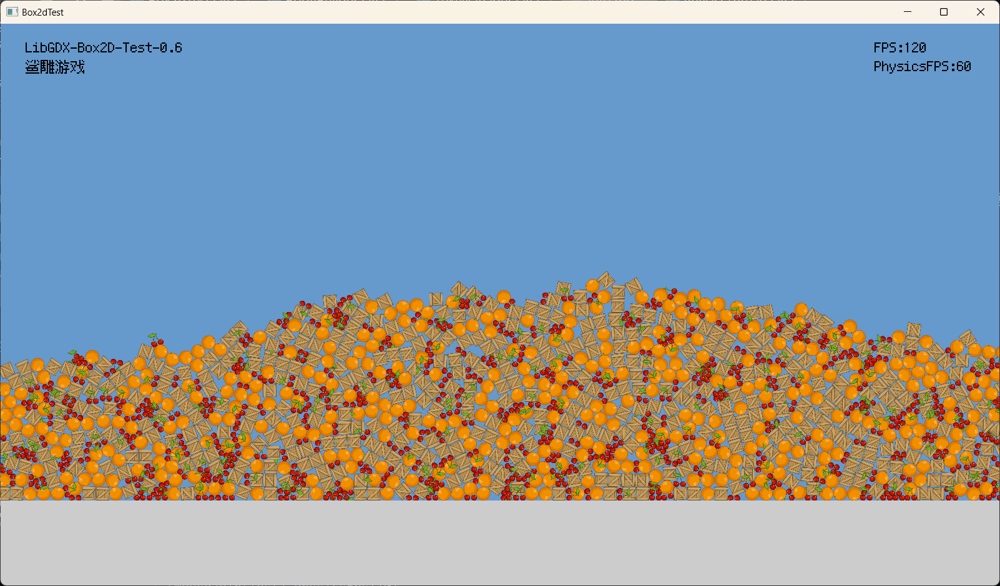

## 一个简单的Libgdx程序
### 说明
使用libgdx框架+Box2d物理引擎的一个测试案例  
简单模拟刚体的运动和相互作用，支持安卓设备多点触摸操作



- 10.23

### 计划
#### 大方向
- 风格：清新、简单、放松，精细的像素风
- 操作：简单、最多两步到位
- 玩法：核心玩法是与物理世界的各种物体进行有趣的交互，并且可以创造自己的组合机构

#### 框架
```
MenuScreen.isKeyPressed()->GameScreen
GameScreen:SpriteManager\SpriteManager\PhysicsWorld\PhysicsThread\UiManager\InputProcessor
        spriteManager.addSprites();//添加textureAtlas里所有的精灵到哈希表Sprites
        physicsWorld.create();//世界初始化
        thread.start(); //启动进程
        
        Gdx.input.setInputProcessor(multiplexer);
        

PhysicsWorld:create()\stepWorld()\drawSprite()\drawGround()
PhysicsThread->physicsWorld.stepWorld();
SpriteManager:addSprites()

```

#### 画面
- 整体偏清新简单的画风，饱和度不能太高
- 要求画风协调统一
### 版本历史
### 2023
- 07.26
  - 原型构建
- 07.29
  - 功能添加：Gui文本显示模块
- 07.31
  - 性能优化：分离物理模拟为单独的线程
- 08.03
  - 多线程共享对象，实现线程数据共享和交互
- 08.04
  - 框架重构：实现Screen
  - 功能添加：添加Menu界面
  - 功能完善：完善Gui文本显示，现在Gui不会随着窗口缩放了
- 08.05
  - 完善物理帧率统计和显示
- 08.07
  - 功能完善：资源加载优化，使用临近纹理过滤
  - 功能完善：更好更准确的物理帧率统计
  - 性能优化：优化物理线程sleep实现，提高帧率
- 09.29
  - 框架重构：实现UiManager，优化ui显示逻辑
  - 功能完善：添加按钮实现
- 10.10
  - 功能完善：游戏输入与ui输入共存
- 10.11
  - 优化：log的优化，添加tag
  - 功能完善：解决按钮事件与游戏事件的冲突
- 10.21
  - 功能完善：添加状态管理器，可以分享对象
- 10.22
  - 功能完善：实现焊接节点，按钮交互
  - 功能完善：实现旋转节点
  - 功能完善：实现暂停逻辑
- 10.23
  - 功能完善：完善暂停逻辑，修复了关闭物体碰撞不生效的Bug

### 2024
- 07.26
  - 问题修复：修复了恢复物体碰撞时物体下坠碰撞不生效的Bug
  - 功能完善：实现了点击按钮保持的功能
  - 功能完善：实现更加稳定的物理帧率控制


### 任务
- [X] 简单的实现
- [X] 简单的用户交互
- [X] 简单的ui
- [X] 添加wheel功能
- [ ] 添加绳子功能
- [X] 添加螺钉功能
- [ ] 添加菜单功能
- [ ] 简单的设置功能
- [ ] 存档功能
- [ ] 组件功能
- [ ] 可自定义的玩意
- [ ] 添加各种千奇百怪的玩意


### 不太可能的任务
- [ ] 局域网联机功能
- [ ] 读取超级玩意的存档
- [ ] 模拟一个真实的太阳系甚至银河系？？
- [ ] 模拟太空航行
- [ ] 引入一个ChatGPT？？？
- [ ] mod功能